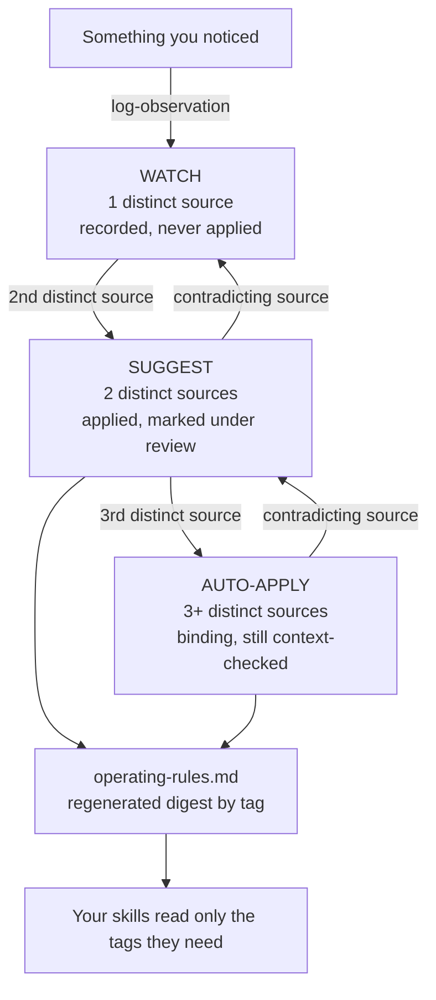

# evidence-ladder

**Your AI learns your business patterns the way a careful person would: one observation is a note, three separate sources make a rule.**

  

Part of **The Compounding Brain** series. Most AI setups forget. This one compounds.

---

## The story

I hired the best person in the world for my job. On day one they knew nothing about my
business, and by tomorrow they had forgotten today. So I stopped looking for a smarter AI and
built it a memory that earns what it believes.

The first piece I built was a glossary that learned my words from call transcripts. It saw a
misheard name once and wrote it down. It saw it again and suggested a fix. On the third
separate call it fixed it without asking. A few weeks in, I was walking out of a sales call
thinking "that is the third team this year that bought a new tool to fix the same broken
step", and I realised I had no ladder for that. The thought would either harden into a
belief I applied everywhere, or vanish by Friday.

Same ladder, different job. The glossary learns words. This learns business patterns.

**Before:** a hunch after a good call, applied to every deal or forgotten.
**After:** a dated entry that names its sources, becomes a rule only when three separate
customers, deals or projects agree, and gets demoted the day the evidence turns. One of the
first rules my own brain earned this way: *buying a better tool never fixes a team that keeps
failing the same way.*

## 60-second quickstart

**Claude Code**

```bash
git clone https://github.com/itstauf/evidence-ladder
cd your-brain
cp -r ../evidence-ladder/.claude/skills/* .claude/skills/
cp ../evidence-ladder/learnings.template.md learnings.md
cp ../evidence-ladder/operating-rules.template.md operating-rules.md
mkdir -p substrates log && cp ../evidence-ladder/log/synthesis-cursor.json log/
```

Then, in Claude Code:

```
/log-observation Two deals this month stalled on "who owns this after handover".
Source: raw/calls/2026-10-01-intro-call.md
```

Run `/synthesize-learnings` once a week. Read `examples/walkthrough.md` to see what happens
over a few months.

**Anywhere else:** paste `prompts/project-instructions.md` into a Claude or ChatGPT Project
and upload the templates.

## How it works



**The ladder.** Every entry sits on one of three rungs. `watch` means one distinct source:
it is written down and never acted on. `suggest` means two: skills apply it, and say
"(under review)". `auto-apply` means three or more: it binds, but only where the situation
matches the conditions it was earned in.

**Substrates.** You choose a few parts of the business worth tracking: customer profile,
sales objections, delivery process, whatever your decisions depend on. Each gets its own file,
its own definition of what counts as a source (different customers, different deals,
different completed projects), and its own Growth Log. The master `learnings.md` catches
everything else.

**The digest.** `operating-rules.md` is regenerated from every `suggest` and `auto-apply`
entry, grouped by tag. A skill that drafts proposals reads `[SALES]` and nothing else.

**Four honesty rules** keep it from becoming a list of moods:
1. Thresholds live in the data file, not the skill.
2. Distinct-source counting is defined per substrate, and the definitions differ.
3. Demotion is symmetric: contradicting evidence demotes one tier, and the reason is logged.
4. Context check on apply: binding is never unconditional.

And every entry must be falsifiable. Details in `docs/the-four-honesty-rules.md`.

**What is new here.** The markdown wiki itself is common, and I credit Andrej Karpathy's LLM
wiki pattern for it. These repos ship the parts nobody else does: how the system decides what
is true, how it polices its own output, and how it grows its own tools. This repo is the
first of those: deciding what is true.

## What is in the box

```
learnings.template.md          rules header, entry format, empty Growth Log
operating-rules.template.md    the regenerated digest, by tag
.claude/skills/
  log-observation/SKILL.md     capture a new observation at watch
  synthesize-learnings/SKILL.md  recount, promote, demote, regenerate, log
substrates/
  _template.md                 one file per part of the business you track
  customer-profile.md          synthetic, counts by customer
  sales-objections.md          synthetic, counts by deal
  delivery-process.md          synthetic, counts by completed project
examples/                      a full learnings file, its digest, and a walkthrough
docs/                          sources, honesty rules, choosing substrates
prompts/project-instructions.md
AGENTS.md
```

All example data is invented. Quillon Works, Juno Freight, Halden & Co and the rest do not
exist.

## Use it your way

### Claude Code

Copy `.claude/skills/log-observation` and `.claude/skills/synthesize-learnings` into your
project's `.claude/skills/`. Copy the two templates to `learnings.md` and
`operating-rules.md`. Add substrates when you need them (`docs/choosing-substrates.md` has a
guided setup prompt). Both skills explain their inputs, outputs and log lines at the top.
If your files live somewhere else, change the paths once at the top of each skill.

### Claude.ai Projects or ChatGPT Projects

Paste `prompts/project-instructions.md` into the project instructions. Upload the templates
and the three `docs/` files as knowledge, then your own `learnings.md` and substrate files
once you have them. The assistant cannot commit, so it hands you the changed files to save.

### Cursor, Codex, or any agent that reads AGENTS.md

`AGENTS.md` points the agent at the same two procedures and lists the rules it must not
break. The skills are plain markdown; nothing depends on Claude Code.

### No agent

Read it as a method. Keep `learnings.md` by hand, count sources honestly, and rewrite
`operating-rules.md` monthly. `examples/` shows exactly what the files look like after a few
months of use.

### Running it with a team

- **Anyone may log.** Every team member can add `watch` entries through `log-observation`.
  Every entry carries an actor.
- **One owner moves tiers.** Only the person or scheduled run that owns synthesis changes
  tiers or regenerates the digest. Put `learnings.md`, `substrates/` and
  `operating-rules.md` under a CODEOWNERS line so changes need that owner's review:

  ```
  /learnings.md          @your-handle
  /substrates/           @your-handle
  /operating-rules.md    @your-handle
  ```
- **Review gate.** Synthesis commits one file per commit. Review promotions and demotions as
  a pull request; reverting one bad promotion does not undo the rest.
- **Feedback counts by person.** In the master file, feedback from a different teammate is a
  distinct source. Two teammates in the same meeting are not.

## What it will not do / honest limits

- **It is slow on purpose.** A substrate that counts different completed projects needs three
  finished projects that agree. In my own business, the master learnings file has earned its
  first binding rules, and my business substrates have barely started compounding. That is
  the design, not a bug. One paid engagement, under NDA, is one source however much it taught.
- **It cannot tell you what a source is.** You define the unit for each substrate. A loose
  definition will promote nonsense quickly. See `docs/what-counts-as-a-source.md`.
- **It does not capture evidence for you.** It needs notes, retros or transcripts to cite.
  Capture is a different room in this series.
- **It is not statistics.** Three sources is a threshold for acting, not proof. Context cues
  and demotion exist because rules will be wrong.
- **The agent can still miscount.** The quality gates in the synthesis skill catch the common
  mistakes. Reviewing the one-file-per-commit diffs catches the rest.

## FAQ

**Why three sources and not five?** Three is where I start trusting a pattern enough to act on
it by default, while context checks and demotion limit the damage when I am wrong. The number
lives in each file. Raise it where mistakes are expensive.

**What if one customer tells me the same thing ten times?** That is one source. Twenty repeats
in one meeting still count as one. Independence is the whole point.

**Do I need substrates on day one?** No. Start with `learnings.md`. Add a substrate when a tag
keeps filling up and needs a stricter way of counting.

**What happens to a demoted rule?** It stays in the file with its full history, drops one
tier, and a Growth Log entry says what contradicted it. If it was at `suggest`, skills still
see it under review. Nothing is deleted.

**How is this different from the glossary?** Same ladder, different job. The glossary counts
transcripts and fixes words. This counts customers, deals or projects and shapes decisions.
Each works without the other.

**Can I use tags other than the starter set?** Yes. Tags are yours. Pick them to match the
decisions your skills make, because skills read the digest by tag.

## Credits

- Regenerated rule digest and logging every run: Tom, YC Root Access, video 01 "the
  self-improving company".
- Three-memory model and skills as procedural memory: Answer This, YC Root Access, video 04.
- LLM wiki / compiled markdown knowledge base: Andrej Karpathy.

## Part of The Compounding Brain

This repo covers two chapters of the guide:
[The ladder](https://itstauf.com/resources/second-brain/ladder?utm_source=github&utm_medium=readme&utm_campaign=compounding-brain&utm_content=evidence-ladder)
and
[What's worth tracking](https://itstauf.com/resources/second-brain/substrates?utm_source=github&utm_medium=readme&utm_campaign=compounding-brain&utm_content=evidence-ladder).
The whole series starts at the
[hub](https://itstauf.com/resources/second-brain?utm_source=github&utm_medium=readme&utm_campaign=compounding-brain&utm_content=evidence-ladder)
and the
[build order](https://itstauf.com/resources/second-brain/build?utm_source=github&utm_medium=readme&utm_campaign=compounding-brain&utm_content=evidence-ladder).

The other repos (each stands alone):

- [brain-starter](https://github.com/itstauf/brain-starter): the house. Plain files, three memories, load order, skills that write skills.
- [learning-glossary](https://github.com/itstauf/learning-glossary): the same ladder, learning your words from transcripts.
- [the-critic](https://github.com/itstauf/the-critic): an adversarial reviewer that checks output before you see it.
- [brain-map](https://github.com/itstauf/brain-map): a link graph that shows what changing one file ripples into.

Building one? Join [Brain Builders](https://itstauf.com/resources/second-brain?utm_source=github&utm_medium=readme&utm_campaign=compounding-brain&utm_content=evidence-ladder#brain-builders).

Made by Taufiq uz Zaman. MIT licensed.
